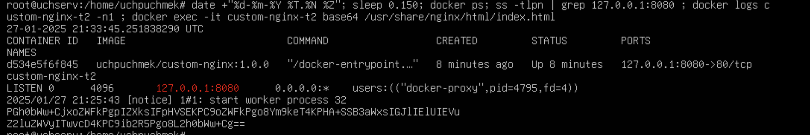
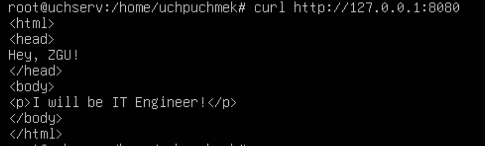
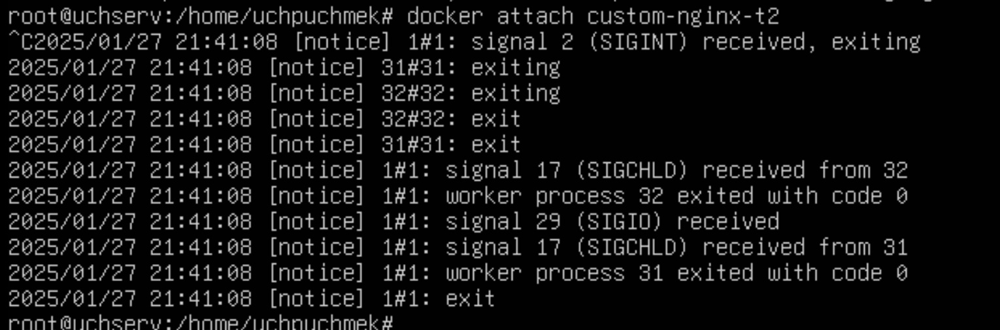
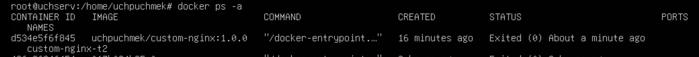
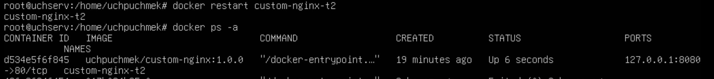
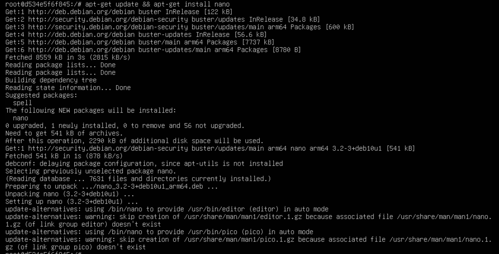
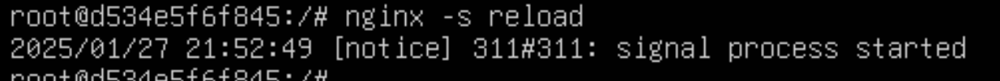
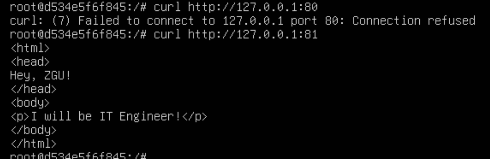
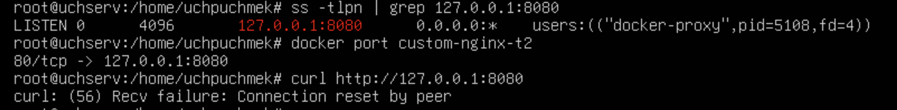
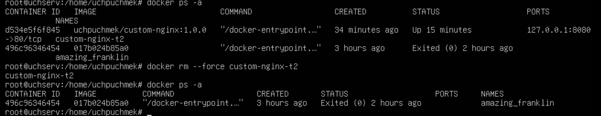

# Лабораторная работа 3
## Выполнила студентка группы ИС-22 Разваляева Мира

## Задача 1

- Отправить образ не получилось


## Задача 2

- Не удаляя, переименуйте контейнер в "custom-nginx-t2".


 Выполните команду```date +"%d-%m-%Y %T.%N %Z"...```


- Убедитесь с помощью curl или веб браузера, что индекс-страница доступна.


## Задача 3
- Подключитесь к контейнеру и нажмите комбинацию Ctrl-C.

- Выполните ```docker ps -a``` и объясните своими словами почему контейнер остановился.


- Перезапустите контейнер.


- Зайдите в интерактивный терминал контейнера "custom-nginx-t2" с оболочкой bash.


- Установите любимый текстовый редактор(vim, nano итд) с помощью apt-get.


8. Запомните(!) и выполните команду ```nginx -s reload```, а затем внутри контейнера ```curl http://127.0.0.1:80 ; curl http://127.0.0.1:81```.



- Проверьте вывод команд: ```ss -tlpn | grep 127.0.0.1:8080``` , ```docker port custom-nginx-t2```, ```curl http://127.0.0.1:8080```. Кратко объясните суть возникшей проблемы.


- Удалите запущенный контейнер "custom-nginx-t2", не останавливая его.(воспользуйтесь --help или google)

